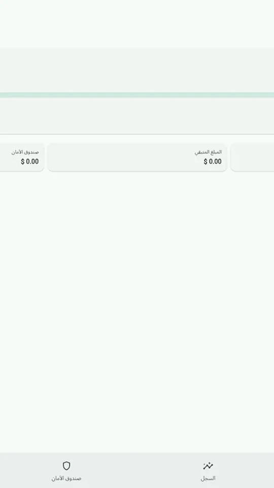
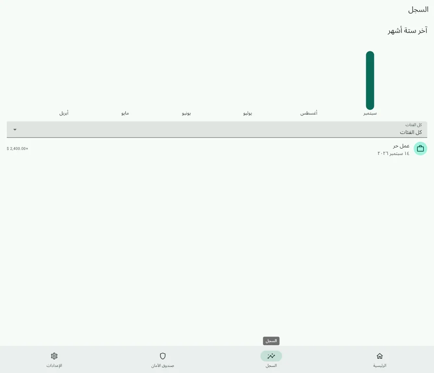
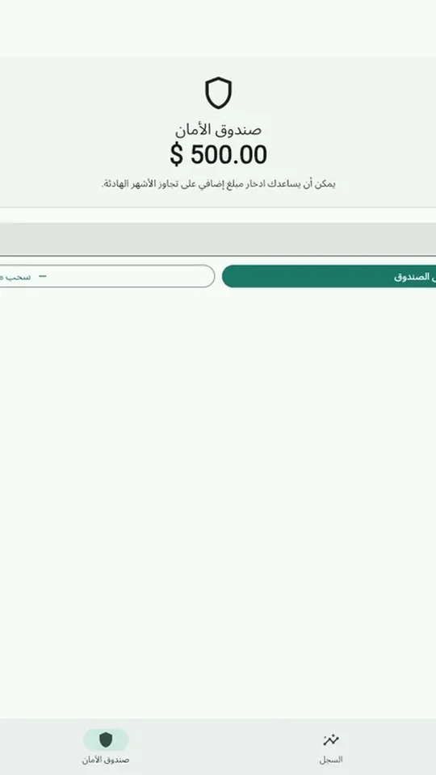
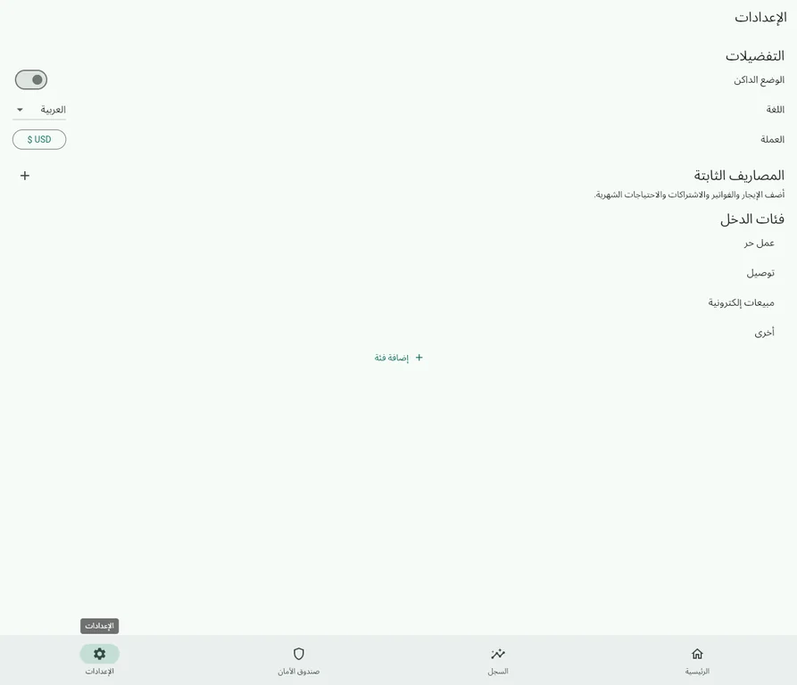
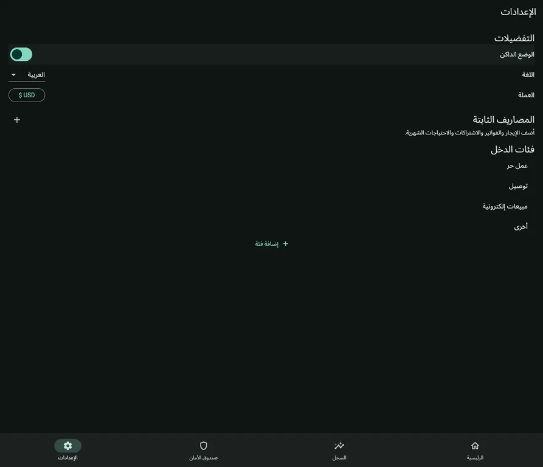
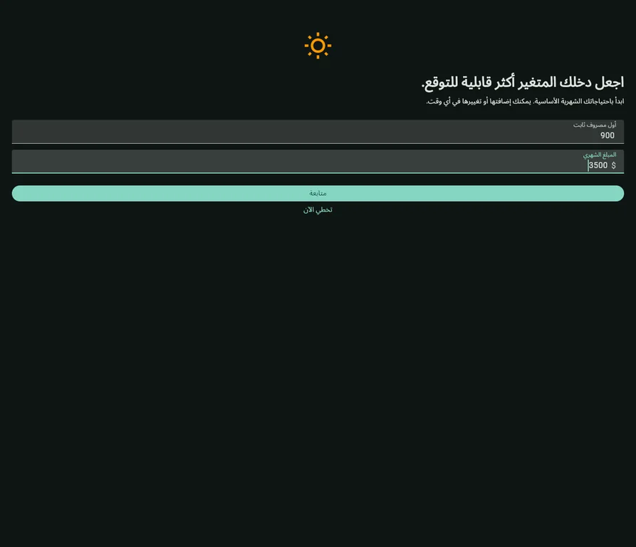
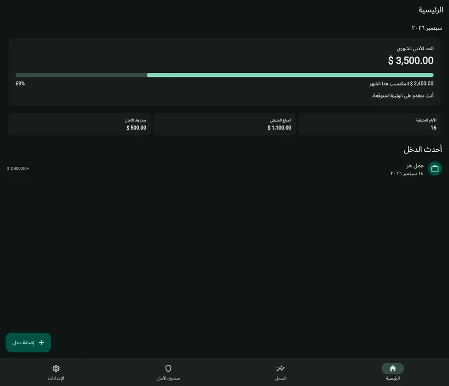
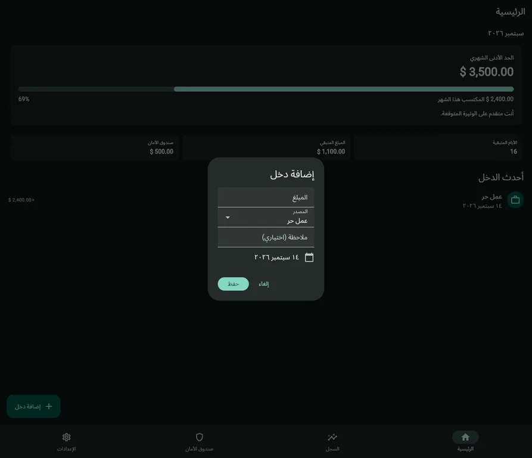
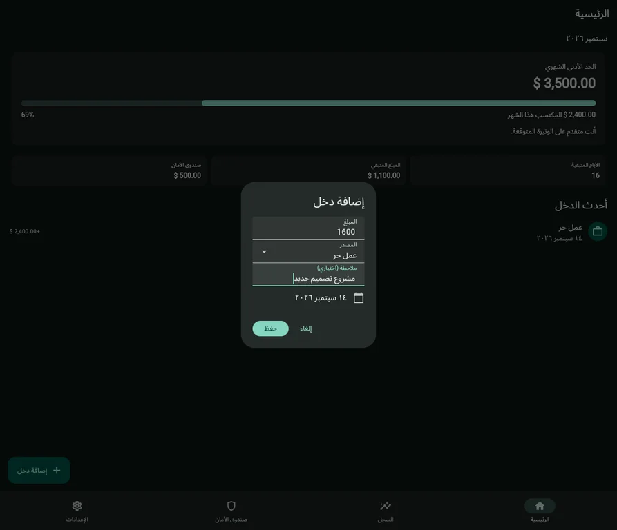

# Irregular Income Budget Tracker

An offline-first Flutter app for tracking variable income, recurring monthly expenses, progress toward a minimum target, and a virtual safety buffer.

## Structure

An offline-first Flutter app for tracking variable income, recurring monthly expenses, progress toward a minimum target, and a virtual safety buffer.
- `lib/services`: Local database access.
- `lib/providers`: App-wide state powered by Provider.
- `lib/screens`: Onboarding, dashboard, history, buffer, and settings screens.

## Getting Started


A few resources to get you started if this is your first Flutter project:

- [Learn Flutter](https://docs.flutter.dev/get-started/learn-flutter)
- [Write your first Flutter app](https://docs.flutter.dev/get-started/codelab)
- [Flutter learning resources](https://docs.flutter.dev/reference/learning-resources)

For help getting started with Flutter development, view the
[online documentation](https://docs.flutter.dev/), which offers tutorials,
samples, guidance on mobile development, and a full API reference.

## UI Preview

The following screenshots were captured from the running Flutter application using populated, realistic financial states.

### 1. Dashboard with recorded income



---

### 2. Income history and six-month chart



---

### 3. Funded safety buffer



---

### 4. Arabic settings and preferences



---

### 5. Dark mode settings



---

### 6. Filled onboarding budget setup



---

### 7. Populated dark dashboard overview



---

### 8. Add income dialog



---

### 9. Income dialog with project note




## Tests

The project includes automated Flutter tests covering the test harness, fixed-expense serialization, income-entry serialization, and supported currency options.

```text
flutter test --reporter expanded
00:00 +4: All tests passed!
```

Static analysis was also run with `flutter analyze --no-fatal-infos`. It reports eight informational style/deprecation notices in the existing splash screen and no fatal warnings.
